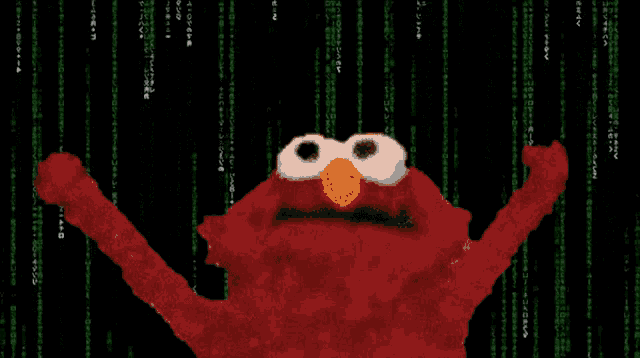

  

  

  

---

    

        
    

    

      
    

    

      
    

    
    

<!---
EyadTamer999/EyadTamer999 is a ✨ special ✨ repository because its `README.md` (this file) appears on your GitHub profile.
You can click the Preview link to take a look at your changes.
--->
